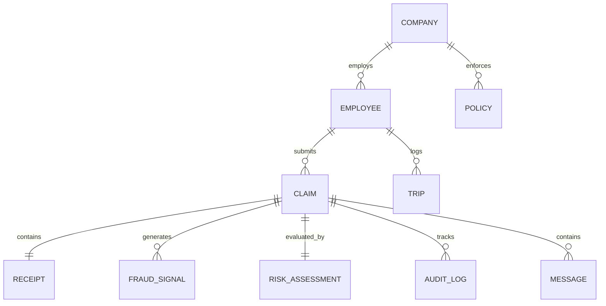

# CLAIMGUARD — Database Schema Specification

## 1. Design Principles
- Every table has an explicit primary key (`id` with descriptive prefixes like `emp_`, `clm_`, `rcpt_`, `sig_`, etc.).
- `created_at` and `updated_at` timestamps on all mutable entities.
- Append-only audit logs to guarantee immutable compliance.
- JSON metadata columns on signals and extractions for extensible OCR & AI payloads.
- Native TypeScript interfaces matching the database schema 1:1.
- In-memory mock/SQLite/PostgreSQL compatible.

---

## 2. Entity Relational Model

---

## 3. Tables & Schema Definitions

### 1. `companies`
| Column | Type | Constraints | Description |
|---|---|---|---|
| `id` | VARCHAR(64) | PK | e.g. `comp_indus_01` |
| `name` | VARCHAR(255) | NOT NULL | e.g. `Apex Logistics India Pvt Ltd` |
| `gstin` | VARCHAR(15) | NULLABLE | Company 15-digit GSTIN |
| `currency` | VARCHAR(3) | DEFAULT 'INR' | Currency code |
| `created_at` | TIMESTAMP | DEFAULT NOW() | Record creation |

### 2. `employees`
| Column | Type | Constraints | Description |
|---|---|---|---|
| `id` | VARCHAR(64) | PK | e.g. `emp_rahul_102` |
| `company_id` | VARCHAR(64) | FK -> companies(id) | Employer company |
| `name` | VARCHAR(255) | NOT NULL | Employee full name |
| `email` | VARCHAR(255) | UNIQUE | Employee email |
| `phone` | VARCHAR(20) | NOT NULL | E.164 phone number (e.g. `+919876543210`) |
| `role` | VARCHAR(50) | DEFAULT 'FIELD_EXECUTIVE'| Role in organization |
| `department` | VARCHAR(100) | DEFAULT 'Field Sales' | Department |
| `historical_claim_count` | INT | DEFAULT 0 | Historical approved claims |
| `historical_claim_avg` | DECIMAL(10,2) | DEFAULT 0.00 | Average historical claim amount |
| `created_at` | TIMESTAMP | DEFAULT NOW() | Record creation |

### 3. `policies`
| Column | Type | Constraints | Description |
|---|---|---|---|
| `id` | VARCHAR(64) | PK | e.g. `pol_fuel_daily` |
| `company_id` | VARCHAR(64) | FK -> companies(id) | Company policy |
| `category` | VARCHAR(50) | NOT NULL | `fuel`, `food`, `travel`, `lodging`, `general` |
| `max_single_claim` | DECIMAL(10,2) | NOT NULL | Maximum claim amount before flagging |
| `requires_gstin` | BOOLEAN | DEFAULT FALSE | Whether valid GSTIN is mandatory |
| `daily_cap` | DECIMAL(10,2) | NULLABLE | Daily spending cap |
| `description` | TEXT | NOT NULL | Human explanation of policy |
| `created_at` | TIMESTAMP | DEFAULT NOW() | Record creation |

### 4. `claims`
| Column | Type | Constraints | Description |
|---|---|---|---|
| `id` | VARCHAR(64) | PK | e.g. `CLM-4471` |
| `company_id` | VARCHAR(64) | FK -> companies(id) | Organization |
| `employee_id` | VARCHAR(64) | FK -> employees(id) | Submitting employee |
| `trip_id` | VARCHAR(64) | FK -> trips(id), NULL | Associated business trip if any |
| `status` | VARCHAR(32) | NOT NULL | `DRAFT`, `PROCESSING`, `PENDING`, `REVIEW_REQUIRED`, `APPROVED`, `REJECTED`, `FAILED` |
| `amount` | DECIMAL(10,2) | NOT NULL | Claim amount in INR |
| `currency` | VARCHAR(3) | DEFAULT 'INR' | Currency |
| `category` | VARCHAR(50) | NOT NULL | `fuel`, `food`, `travel`, `lodging`, `misc` |
| `vendor_name` | VARCHAR(255) | NOT NULL | Extracted or confirmed vendor |
| `claim_date` | DATE | NOT NULL | Date of receipt expense |
| `gstin` | VARCHAR(15) | NULLABLE | Vendor GSTIN |
| `manager_id` | VARCHAR(64) | NULLABLE | Approving/rejecting manager |
| `manager_notes` | TEXT | NULLABLE | Reason note provided by manager |
| `created_at` | TIMESTAMP | DEFAULT NOW() | Submission timestamp |
| `updated_at` | TIMESTAMP | DEFAULT NOW() | Last state transition |

### 5. `receipts`
| Column | Type | Constraints | Description |
|---|---|---|---|
| `id` | VARCHAR(64) | PK | e.g. `rcpt_83921` |
| `claim_id` | VARCHAR(64) | FK -> claims(id) | Associated claim |
| `file_url` | VARCHAR(512) | NOT NULL | Storage path or CDN URL |
| `file_name` | VARCHAR(255) | NOT NULL | Cleaned file name |
| `mime_type` | VARCHAR(100) | NOT NULL | `image/jpeg`, `image/png`, `image/webp` |
| `file_size` | INT | NOT NULL | File size in bytes |
| `image_hash` | VARCHAR(64) | NOT NULL | Perceptual dHash / sha256 fingerprint |
| `raw_ocr_text` | TEXT | NULLABLE | Full OCR extracted text |
| `ocr_confidence` | JSON | NOT NULL | Field-level confidences (vendor, amount, date) |
| `created_at` | TIMESTAMP | DEFAULT NOW() | Upload timestamp |

### 6. `fraud_signals`
| Column | Type | Constraints | Description |
|---|---|---|---|
| `id` | VARCHAR(64) | PK | e.g. `sig_9021` |
| `claim_id` | VARCHAR(64) | FK -> claims(id) | Associated claim |
| `type` | VARCHAR(64) | NOT NULL | `DUPLICATE_RECEIPT`, `AMOUNT_ANOMALY`, `DATE_MISMATCH`, `CATEGORY_MISMATCH`, `POLICY_VIOLATION`, `GSTIN_SIGNAL`, `WEEKEND_CLAIM` |
| `severity` | VARCHAR(16) | NOT NULL | `LOW`, `MEDIUM`, `HIGH`, `CRITICAL` |
| `score_impact` | INT | NOT NULL | Deterministic score penalty (+10, +20, +40) |
| `description` | TEXT | NOT NULL | Explanatory description |
| `confidence` | DECIMAL(4,2) | DEFAULT 1.00 | Signal confidence (0.00 to 1.00) |
| `metadata` | JSON | NULLABLE | Contextual proof (matched claim ID, diff values, etc.) |
| `created_at` | TIMESTAMP | DEFAULT NOW() | Creation timestamp |

### 7. `risk_assessments`
| Column | Type | Constraints | Description |
|---|---|---|---|
| `id` | VARCHAR(64) | PK | e.g. `risk_4471` |
| `claim_id` | VARCHAR(64) | FK -> claims(id) | Associated claim |
| `score` | INT | NOT NULL | 0 to 100 integer score |
| `level` | VARCHAR(16) | NOT NULL | `LOW` (0-29), `MEDIUM` (30-59), `HIGH` (60-79), `CRITICAL` (80-100) |
| `recommended_action` | VARCHAR(32) | NOT NULL | `APPROVE_RECOMMENDED`, `REVIEW_REQUIRED`, `REJECT_RECOMMENDED` |
| `summary` | TEXT | NOT NULL | Synthesized human-readable risk summary |
| `rules_triggered` | JSON | NOT NULL | Array of triggered rule codes |
| `created_at` | TIMESTAMP | DEFAULT NOW() | Assessment timestamp |

### 8. `audit_logs`
| Column | Type | Constraints | Description |
|---|---|---|---|
| `id` | VARCHAR(64) | PK | e.g. `aud_10821` |
| `claim_id` | VARCHAR(64) | FK -> claims(id) | Associated claim |
| `actor_type` | VARCHAR(32) | NOT NULL | `EMPLOYEE`, `SYSTEM_OCR`, `SYSTEM_FRAUD_ENGINE`, `MANAGER` |
| `actor_id` | VARCHAR(64) | NOT NULL | User or system agent identifier |
| `action` | VARCHAR(64) | NOT NULL | `CLAIM_CREATED`, `RECEIPT_UPLOADED`, `OCR_COMPLETED`, `FRAUD_EVALUATED`, `CLAIM_SUBMITTED`, `CLAIM_APPROVED`, `CLAIM_REJECTED` |
| `details` | JSON | NOT NULL | Detailed action payload and state diff |
| `created_at` | TIMESTAMP | DEFAULT NOW() | Immutable timestamp |

### 9. `trips`
| Column | Type | Constraints | Description |
|---|---|---|---|
| `id` | VARCHAR(64) | PK | e.g. `trip_blr_mys_01` |
| `employee_id` | VARCHAR(64) | FK -> employees(id) | Field employee |
| `title` | VARCHAR(255) | NOT NULL | e.g. `Bengaluru - Mysuru Client Visit` |
| `origin` | VARCHAR(100) | NOT NULL | Origin city |
| `destination` | VARCHAR(100) | NOT NULL | Destination city |
| `start_date` | DATE | NOT NULL | Departure date |
| `end_date` | DATE | NOT NULL | Return date |
| `status` | VARCHAR(32) | DEFAULT 'COMPLETED' | `ACTIVE`, `COMPLETED` |
| `created_at` | TIMESTAMP | DEFAULT NOW() | Creation timestamp |

### 10. `messages`
| Column | Type | Constraints | Description |
|---|---|---|---|
| `id` | VARCHAR(64) | PK | e.g. `msg_1092` |
| `claim_id` | VARCHAR(64) | NULLABLE | Associated claim if relevant |
| `employee_id` | VARCHAR(64) | FK -> employees(id) | Employee chat session |
| `sender` | VARCHAR(16) | NOT NULL | `EMPLOYEE`, `CLAIMGUARD_BOT` |
| `content` | TEXT | NOT NULL | Text content |
| `message_type` | VARCHAR(32) | NOT NULL | `TEXT`, `IMAGE_PROMPT`, `EXTRACTED_CARD`, `STATUS_UPDATE`, `ACTION_BUTTONS` |
| `payload` | JSON | NULLABLE | Structured card buttons, extracted fields, etc. |
| `created_at` | TIMESTAMP | DEFAULT NOW() | Message timestamp |
