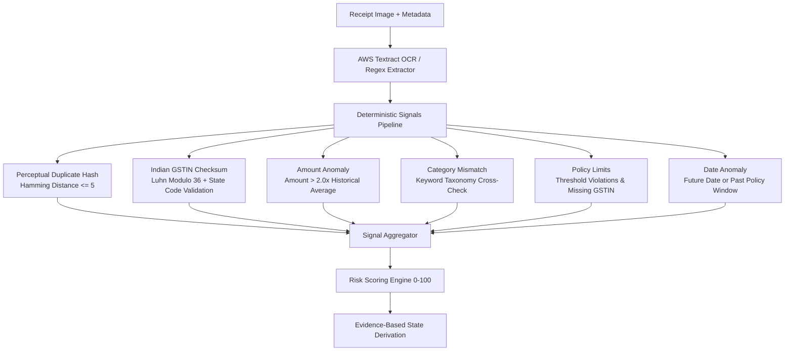

# ClaimGuard Deterministic Fraud Detection Engine

ClaimGuard enforces strict, reproducible, and explainable fraud detection. Unlike unconstrained probabilistic models, **all fraud signals and risk scores in ClaimGuard are deterministic**. Artificial Intelligence (Claude 3.5 Sonnet on AWS Bedrock) is employed solely for explanatory synthesis, never for black-box approval, rejection, or score generation.

---

## 1. Fraud Detection Signals & Algorithms



---

## 2. Signal Specifications

### Signal 1: Perceptual Duplicate Hash (`DUPLICATE_RECEIPT`)

- **Objective**: Prevent the same receipt image from being submitted multiple times across employees, departments, or dates.
- **Algorithm**: Hexadecimal perceptual hash comparison using Hamming Distance:
  $$D_H(h_1, h_2) = \sum_{i=1}^{n} (h_{1,i} \oplus h_{2,i})$$
- **Collision Threshold**: If $D_H \le 5$, the receipt is flagged as an exact or edited duplicate.
- **Severity Impact**: **+40 points** (High Severity).
- **Metadata Returned**: Matched claim ID, original submitter ID, original claim date.

---

### Signal 2: GSTIN Luhn Modulo-36 Checksum (`INVALID_GSTIN`)

- **Objective**: Verify that the 15-character Indian Goods and Services Tax Identification Number (GSTIN) printed on the receipt is mathematically authentic.
- **Format**: `29AAAAA0000A1Z5` (2 digits state code, 10 digits PAN, 1 digit entity number, 'Z', 1 checksum char).
- **State Code Validation**: 2-digit prefix matched against official GST State Codes (`01` Jammu & Kashmir through `38` Ladakh, `97` Other Territory).
- **Luhn Modulo-36 Calculation**:
  ```typescript
  const CHARS = "0123456789ABCDEFGHIJKLMNOPQRSTUVWXYZ";
  let factor = 1;
  let sum = 0;
  for (let i = 0; i < 14; i++) {
    let codePoint = CHARS.indexOf(gstin[i]);
    let digit = codePoint * factor;
    digit = Math.floor(digit / 36) + (digit % 36);
    sum += digit;
    factor = factor === 2 ? 1 : 2;
  }
  let checkCodePoint = (36 - (sum % 36)) % 36;
  let checkChar = CHARS[checkCodePoint];
  ```
- **Severity Impact**: **+25 points** (Medium Severity).

---

### Signal 3: Historical Amount Anomaly (`AMOUNT_ANOMALY`)

- **Objective**: Flag expense submissions that deviate drastically from an employee's historical spending profile in that category.
- **Formula**:
  $$\text{Ratio} = \frac{\text{Claim Amount}}{\text{Employee Historical Average}}$$
  If $\text{Ratio} > 2.0$ and $\text{Historical Claim Count} \ge 3$:
  - Severity: Medium.
  - Severity Impact: **+20 points**.

---

### Signal 4: Category Keyword Mismatch (`CATEGORY_MISMATCH`)

- **Objective**: Prevent misattribution of expenses (e.g. personal dining claimed as vehicle fuel).
- **Detection**: Cross-references vendor name and extracted line items against an Indian merchant taxonomy dictionary (`FUEL` keywords: `Petrol, Diesel, HPCL, BPCL, IOCL`; `MEALS` keywords: `Restaurant, Cafe, Dhaba, Barbeque, Hotel Dining`).
- **Severity Impact**: **+20 points** (Medium Severity).

---

### Signal 5: Policy Cap Violation (`POLICY_VIOLATION`)

- **Objective**: Enforce company-wide expense limits.
- **Rules**:
  - `amount > maxSingleClaim`: Flags policy limit breach.
  - `amount > gstinThreshold && !gstin`: Flags missing required tax invoice identifier.
- **Severity Impact**: **+15 points** (Low/Medium Severity).

---

### Signal 6: Date & Timing Anomaly (`DATE_ANOMALY`)

- **Objective**: Detect backdated expenses outside filing windows or future-dated fraudulent invoices.
- **Rules**:
  - `claimDate > today`: Invariant violation (Future dated).
  - `daysAgo > 90`: Outdated expense beyond policy submission window.
- **Severity Impact**: **+15 points** (Low Severity).

---

## 3. Server Implementation Verification

The deterministic fraud engine is implemented in `server/src/services/fraudService.ts` and `src/services/fraud/`. Tested hermetically with 100% pass rate:

```
✔ Scenario 1: Clean Claim Evaluation (LOW Risk, 0 signals)
✔ Scenario 2: Duplicate Receipt Detection (HIGH Risk, +40)
✔ Scenario 3: Amount Anomaly (>2x Employee Average, +20)
✔ Scenario 4: Category Mismatch (Dining claimed as Fuel, +20)
✔ Scenario 5: Policy Violation (Exceeds Policy Cap, +15)
✔ Scenario 7: Multiple Compounding Signals -> CRITICAL Risk (Score 80+, REJECT_RECOMMENDED)
```
