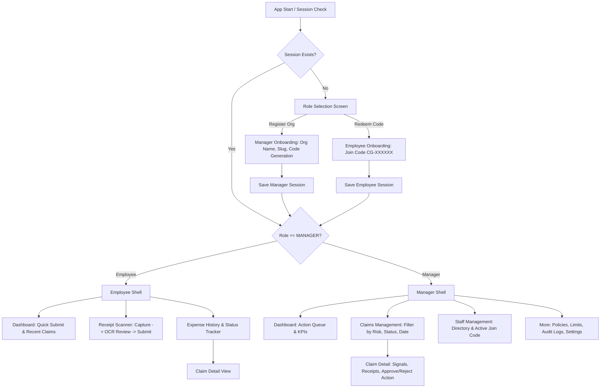

# ClaimGuard Mobile Architecture Specification

The ClaimGuard mobile application is built using **Flutter 3.44** and **Dart 3.12**, providing a unified, role-aware enterprise expense management and fraud deterrence client.

---

## 1. Architectural Principles

1. **Single Application Binary, Dual Persona**:
   - Both Employees and Managers use the exact same binary (`com.claimguard.app`).
   - The user session returned by the central backend (`Session.role`) dynamically renders either the **Employee Shell** (bottom navigation: Dashboard, Scanner, History) or the **Manager Shell** (bottom navigation: Dashboard, Claims Review, Employees, More).
   - Instant role toggling is available in the header for dev/staging environments.

2. **Decoupled State Management**:
   - `AppState` extends `ChangeNotifier` to hold reactive session data, active claims list, metrics, and network state.
   - The mobile client interacts exclusively with the standalone ClaimGuard Fastify backend (`/api/v1`) via `ClaimGuardApiService`.
   - Built-in fallback caching ensures offline resiliency and rapid prototype demonstration without network dependency.

3. **Strict Enterprise Design System**:
   - Palette: Signal Orange (`#F97316`), Slate Dark (`#0F172A`), Slate Secondary (`#334155`), Canvas Off-White (`#F8FAFC`).
   - Ratio: 40% Minimal, 30% Brutalism, 20% Glass, 10% Clay.
   - Evidence-based badges with zero ambiguous claims (e.g. `VERIFIED`, `LIKELY VALID`, `REVIEW REQUIRED`, `SUSPICIOUS`, `UNABLE TO VERIFY`).
   - Zero emojis, zero simulated green LEDs, zero hacker UI tropes.

---

## 2. Directory Structure

```
apps/mobile/
├── android/                   # Native Android Gradle configuration (Namespace: com.claimguard.app)
│   ├── app/
│   │   ├── build.gradle       # minSdk 21, targetSdk 34, compileSdk 34
│   │   └── src/main/
│   │       └── AndroidManifest.xml  # Camera, Internet, Storage permissions
├── lib/
│   ├── core/
│   │   ├── models/
│   │   │   ├── claim.dart     # Claim, ReceiptLineItem, FraudSignal, RiskAssessment
│   │   │   └── session.dart   # Session, Organization, JoinCode, UserProfile
│   │   ├── providers/
│   │   │   └── app_state.dart # Reactive ChangeNotifier app state
│   │   ├── services/
│   │   │   └── api_service.dart # HTTP REST client to Fastify backend
│   │   ├── shell/
│   │   │   ├── employee_shell.dart # Employee bottom nav scaffold
│   │   │   └── manager_shell.dart  # Manager bottom nav scaffold
│   │   ├── theme/
│   │   │   └── claimguard_theme.dart # Typography, colors, borders, cards
│   │   └── widgets/
│   │       ├── brand_header.dart   # Sticky header with role badge & switcher
│   │       ├── claim_card.dart     # Dense claim card with risk pill & amounts
│   │       └── evidence_badge.dart # Evidence-based badge component
│   ├── features/
│   │   ├── claims/
│   │   │   ├── claim_detail_screen.dart # Detailed line items, signals, audit trail
│   │   │   └── claims_list_screen.dart  # Filterable claim list (Pending, High Risk, All)
│   │   ├── dashboard/
│   │   │   ├── employee_dashboard_screen.dart # Claim stats, recent activity, submit CTA
│   │   │   └── manager_dashboard_screen.dart  # Action queue, high-risk flags, KPI cards
│   │   ├── employees/
│   │   │   └── employees_screen.dart # Directory, search, join-code copy & regenerate
│   │   ├── more/
│   │   │   └── manager_more_screen.dart # Settings, policies, audit logs, account
│   │   ├── onboarding/
│   │   │   ├── employee_onboarding_screen.dart # CG-XXXXXX join code redemption
│   │   │   ├── manager_onboarding_screen.dart  # Org creation & join code generation
│   │   │   └── role_selection_screen.dart      # Welcome landing & role picker
│   │   └── receipt_scanner/
│   │       └── receipt_scanner_screen.dart # Camera/file capture, OCR extraction, line items
│   └── main.dart              # Root entry point & dynamic shell router
└── test/
    ├── unit/
    │   └── state_and_models_test.dart # Model JSON serialization & state tests
    └── widget/
        └── onboarding_and_routing_test.dart # Navigation & widget tests
```

---

## 3. Screen Hierarchy & Navigation Flows



---

## 4. State Management Lifecycle

1. **Initialization (`main.dart`)**:
   - `AppState` is initialized with pre-seeded demo sessions for ABC Technologies (`Priya Sharma` as Manager, `Rahul Kumar` as Employee).
   - On startup, `AppState.refreshClaims()` fetches live claims from Fastify `/api/v1/claims`.
2. **Dynamic Role Switching**:
   - Tapping the role badge in `BrandHeader` triggers `AppState.switchRole(Role)`.
   - The root router rebuilds without app restart, smoothly transitioning the UI between `EmployeeShell` and `ManagerShell`.
3. **Claim Actions**:
   - `approveClaim(id, notes)` sends POST `/api/v1/claims/:id/approve` and updates local state optimistically.
   - `rejectClaim(id, reason)` requires a mandatory reason, sends POST `/api/v1/claims/:id/reject`, and records the audit log.
   - Submissions from `ReceiptScannerScreen` emit POST `/api/v1/claims`, which run deterministic fraud checks and refresh both employee and manager queues.
