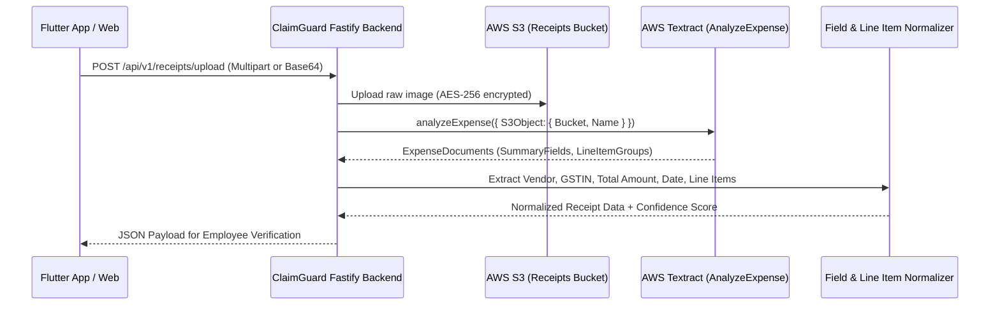

# ClaimGuard Receipt OCR & Information Extraction

ClaimGuard extracts structured financial data from raw receipt photographs and scanned PDFs using **AWS Textract (AnalyzeExpense / DetectDocumentText)** combined with an intelligent Indian tax invoice parser.

---

## 1. Extraction Pipeline Architecture



---

## 2. Extracted Fields & Normalized Output

| Field Name | Description | Extraction Strategy | Fallback Pattern |
|---|---|---|---|
| `vendorName` | Merchant/Business Name | `VENDOR_NAME` Expense Summary Field | Top-most prominent text block |
| `gstin` | 15-char Indian Tax ID | Regex match `[0-9]{2}[A-Z]{5}[0-9]{4}[A-Z]{1}[1-9A-Z]{1}Z[0-9A-Z]{1}` | Text block scan |
| `claimDate` | Invoice / Receipt Date | `INVOICE_RECEIPT_DATE` Expense Summary Field | Regex `\d{2}[/-]\d{2}[/-]\d{4}` normalized to ISO `YYYY-MM-DD` |
| `totalAmount`| Gross Total | `TOTAL` / `AMOUNT_PAID` Expense Summary Field | Max numeric float with currency symbol |
| `category` | Inferred Expense Category| Merchant classification dictionary | `MISC` |
| `lineItems` | Detailed itemized breakdown| `EXPENSE_ROW` LineItemGroups | Item name, qty, rate, subtotal |

### Sample JSON Output

```json
{
  "vendorName": "Indian Oil Corporation Ltd",
  "gstin": "29AAACI1681G1Z1",
  "claimDate": "2026-09-19",
  "totalAmount": 3850.00,
  "currency": "INR",
  "category": "FUEL",
  "ocrConfidence": {
    "vendorName": 0.98,
    "amount": 0.99,
    "date": 0.95,
    "overall": 0.97
  },
  "lineItems": [
    {
      "item": "Diesel High Speed (42.3L)",
      "quantity": 42.3,
      "rate": 91.00,
      "amount": 3850.00
    }
  ]
}
```

---

## 3. Confidence Thresholds & Error Handling

- **High Confidence ($\ge 0.85$)**: Field populated automatically in employee review form; highlights verified badge.
- **Medium Confidence ($0.70 – 0.84$)**: Field populated with subtle review flag for employee verification.
- **Low Confidence ($< 0.70$)**: Triggers `OCR_LOW_CONFIDENCE` signal. Flags receipt as `UNABLE TO VERIFY`, prompting user to manually review and confirm fields before submission.
- **Offline / Local Fallback**: When AWS Textract credentials are not provided (e.g. `NODE_ENV=test` or demo sandbox), the backend falls back to built-in deterministic heuristic extraction, allowing seamless development and testing.
