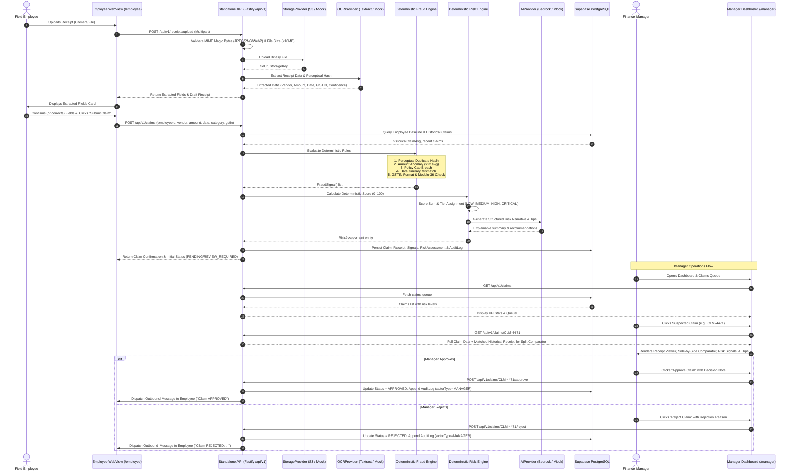

# ClaimGuard — End-to-End System Flow & Verification Lifecycle

**Product Tagline**: Flag it before you pay it.  
**Core Principle**: AI Assists. Humans Decide.

---

## 1. Complete End-to-End Sequence Diagram

---

## 2. Key Lifecycle Stages

### Stage 1: Client Ingestion & Sanitization
1. Receipt is captured or uploaded via the mobile WebView.
2. File is inspected for binary signatures (`FF D8 FF` for JPEG, `89 50 4E 47` for PNG, `RIFF...WEBP` for WebP). Unsafe or oversized files (>10MB) are rejected immediately with HTTP 415 / 413.

### Stage 2: Optical Extraction & Normalization
1. OCR extracts textual fields: Vendor Name, Total Amount, Transaction Date, Indian GSTIN (15-character statutory tax ID).
2. Per-field optical confidence scores are generated. If confidence falls below 70%, the card visually prompts the employee to verify values before submission.
3. A 64-bit DCT perceptual image fingerprint is calculated from the raw receipt pixels.

### Stage 3: Deterministic Rule Verification
Business rules run without nondeterministic LLM interference:
- **Duplicate Receipt**: Compares perceptual hash against all prior approved company claims using bitwise Hamming distance ($\le 4$ bits distance = exact duplicate, $\le 8$ bits = near duplicate).
- **Amount Anomaly**: Flags if requested amount exceeds $2.0\times$ the employee's verified historical claim average.
- **Policy Ceiling**: Flags if amount breaches category caps (e.g. Fuel ₹4,000, Food ₹1,500).
- **GSTIN Validation**: Validates 15-character alphanumeric format, state code (01–38), and modulo-36 checksum.

### Stage 4: Risk Scoring & AI Explanation
1. Risk score is computed as a deterministic 0–100 integer:
   - Duplicate receipt: $+40$
   - Policy violation: $+20$
   - Amount anomaly: $+15$
   - Date mismatch: $+15$
   - Category breach: $+10$
   - GSTIN mismatch: $+15$
2. AI (AWS Bedrock / Mock Provider) takes the structured claim metadata and triggered signals, synthesizing an operational explanation with concrete managerial recommendations.

### Stage 5: Manager Decision & Audit Immutability
1. High and Critical claims appear prominently on the manager review queue.
2. The manager reviews the dual-pane workspace with image zoom and side-by-side visual duplicate comparison.
3. Every approval, rejection, or clarification request appends an immutable audit event recording `actorId`, `action`, `timestamp`, and `details`.
