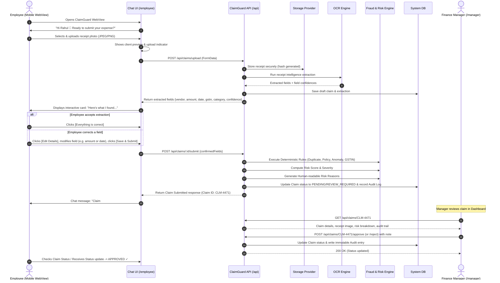

# CLAIMGUARD — User Flows & Interaction Sequences

## 1. Employee Journey: "One Perfect Claim"

---

## 2. Low-Confidence & Error Recovery Journey
1. **Blurry / Cut-off Receipt Upload**:
   - Employee uploads an out-of-focus or torn fuel bill.
   - OCR engine returns confidence `< 0.70` on `amount` or `vendorName`.
   - The UI does **not** fail silently; instead, it highlights low-confidence fields with a warning badge:
     *"Some fields couldn't be clearly read. Please verify before submitting."*
   - Pre-fills whatever text was detected and prompts the employee with quick inline edit inputs.
2. **Unsupported File / Size Limit**:
   - Client-side & server-side validation immediately rejects non-image formats (e.g. `.exe`, `.zip`) or files `> 10MB` with an intuitive conversational message:
     *"Only image receipts (JPG, PNG, WebP) under 10MB are supported."*

---

## 3. Manager Review Journey
1. **Overview**:
   - Manager logs in at `/manager`.
   - Views aggregate KPIs: Total claims pending, breakdown by risk severity (Low, Medium, High, Critical), total Rupees flagged for policy breaches.
2. **Claim Prioritization**:
   - Claims table sorted by risk score descending or date submitted.
   - Quick filters: `High Risk Only`, `Duplicate Suspects`, `Category: Fuel`, `Status: Pending`.
3. **Deep-Dive Review**:
   - Clicks on a claim (e.g. `CLM-4471`).
   - Split layout:
     - **Left**: High-res zoomable receipt viewer with extracted bounding boxes / OCR text overlays. If duplicate detected, split-view comparison with the original historical claim.
     - **Right**:
       - Employee context (Rahul Kumar, ₹12,400 monthly claims, 98% approval rate).
       - Risk score meter (e.g. 78/100 - HIGH) with breakdown cards:
         - 🚨 **Duplicate Receipt**: 99% visual perceptual hash match with Claim `CLM-3902` submitted on Aug 14 by Amit Verma.
         - ⚠️ **Amount Anomaly**: ₹3,850 is 140% above employee historical average (₹1,600).
         - ⚠️ **Policy Limit**: Fuel policy daily limit is ₹2,500.
         - ✅ **GSTIN Format**: Valid format, Karnataka state code 29.
       - Immutable Audit Timeline:
         - `10:14:02` Claim submitted by Rahul Kumar
         - `10:14:04` OCR processed (Confidence: 0.94)
         - `10:14:05` Risk evaluated (Score: 78)
4. **Decision & Action**:
   - Manager clicks **[Approve]** or **[Reject]**.
   - A modal requires an optional note (mandatory on rejection, e.g. *"Duplicate bill of Amit's trip"*).
   - Audit event logged. Status transitions to `APPROVED` or `REJECTED`.
